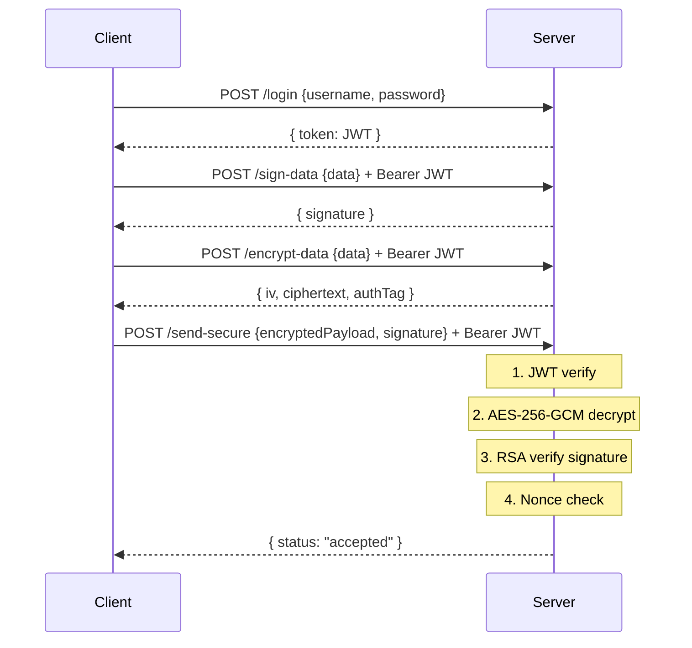

# PROJECT REPORT

---

**Project Title:** Fake Data Prevention with Conventional Cryptographic Tools

**Course:** System Security

**Student Name:** [Yermek Aubayev]


---

## Abstract

The proliferation of networked systems has created a critical need for mechanisms that verify the authenticity and integrity of data exchanged between clients and servers. Without such controls, any party with network access can submit arbitrary or falsified data, and the receiving server has no means of distinguishing a legitimate request from a fabricated one. This project, designated SEC-PRJ-7E_25, addresses this problem by designing, implementing, and demonstrating a system that prevents fake and tampered data from being accepted by a server, using exclusively conventional and standardized cryptographic tools.

The system is built on a Node.js/Express HTTPS server providing two contrasting endpoints: a deliberately vulnerable endpoint that accepts all input, and a fully protected endpoint enforcing four independent cryptographic layers. The security stack comprises Transport Layer Security (TLS) with a self-signed X.509 certificate, JSON Web Tokens (JWT, HS256) for stateless authentication, AES-256-GCM for payload confidentiality and ciphertext integrity, RSA-2048 digital signatures for data integrity and tamper detection, UUID-based nonce validation for replay attack prevention, and bcrypt password hashing (cost factor 10) for credential security.

Five interactive demonstration scenarios isolate each attack vector and its corresponding countermeasure. The project confirms that fake data injection succeeds against the unprotected endpoint, while tampering and replay attacks are detected and rejected by the protected endpoint. The central conclusion is that fake data prevention requires a layered approach in which each tool addresses a distinct security property — identity, confidentiality, integrity, freshness, and transport security — that the others cannot substitute.

---

## Table of Contents

1. Introduction
2. Literature Review
3. Project Overview
4. System Architecture
5. Implemented Security Mechanisms
   - 5.1 TLS Certificates and HTTPS
   - 5.2 JWT Authentication
   - 5.3 AES-256-GCM Encryption
   - 5.4 RSA-2048 Digital Signatures
   - 5.5 Replay Attack Protection
   - 5.6 bcrypt Password Hashing
6. Implementation Details
7. Demonstration Scenarios
8. Results and Security Analysis
9. Limitations and Future Improvements
10. Conclusion
11. References

---

## 1. Introduction

### 1.1 The Digital Data Integrity Problem

The rapid expansion of internet-connected systems has transformed how organizations collect, process, and act upon data. From financial transactions to medical records and industrial control systems, virtually every domain relies on digital data exchange between distributed clients and servers. This dependency raises a fundamental security question: how can a server verify that received data is authentic — that it was not fabricated, modified, or replayed by a malicious party?

Without explicit integrity controls, a server accepting JSON payloads has no mechanism to distinguish a legitimate request from an adversary-crafted one. A server endpoint that processes `{ "amount": 100 }` will process `{ "amount": 99999 }` identically, because both are syntactically valid JSON. The server's application logic has no visibility into whether the value was set by the original sender or altered in transit.

### 1.2 Threat Model: Fake Data Injection

Fake data injection encompasses several distinct threat vectors:

- **Unauthenticated access:** An adversary submits requests without valid credentials, exploiting endpoints that perform no authentication.
- **Man-in-the-middle tampering:** An adversary intercepts a request and modifies field values. Without a digital signature, the server cannot detect the modification.
- **Replay attacks:** An adversary captures a complete, valid, authenticated request and retransmits it to trigger duplicate actions.
- **Credential attacks:** An adversary brute-forces authentication credentials to gain access to protected endpoints.

Each vector is independent and requires a dedicated cryptographic countermeasure. A system addressing only transport encryption remains vulnerable to insider modification, replay, and credential brute-force.

### 1.3 The Role of Cryptography

Cryptography provides the mathematical foundations for all countermeasures. AES-256-GCM provides confidentiality and ciphertext integrity. RSA-2048 provides digital signatures binding a payload to a key holder. HMAC-SHA256 (used in JWT) provides authentication tokens resistant to forgery. Nonce-based protocols guarantee freshness, preventing replay. Together, these tools form a layered security architecture in which the failure of any single layer does not compromise the overall system.

### 1.4 Project Objectives

1. Implement a Node.js HTTPS server with an unprotected endpoint (demonstrating the vulnerability) and a protected endpoint (demonstrating the solution).
2. Integrate TLS/HTTPS, JWT, AES-256-GCM, RSA-2048, nonce-based replay protection, and bcrypt.
3. Develop five interactive scenarios making each security property directly observable.
4. Document the security properties, implementation, and limitations in sufficient depth for academic review.

---

## 2. Literature Review

### 2.1 Fundamentals of Cryptography

Cryptography is the discipline of designing communication systems that remain secure in the presence of adversaries [1]. Modern systems are founded on computational hardness assumptions — the belief that certain mathematical problems (factoring large integers, computing discrete logarithms) cannot be solved in polynomial time. Shannon's foundational work [2] established the concepts of confusion and diffusion, which underpin all modern block cipher designs. Confusion makes the relationship between plaintext and ciphertext complex; diffusion spreads the influence of each plaintext bit across many ciphertext bits. Both properties are realized in AES.

### 2.2 Symmetric Encryption

The Advanced Encryption Standard (AES), standardized by NIST in FIPS PUB 197 [3], is a substitution-permutation network operating on 128-bit blocks with key sizes of 128, 192, or 256 bits. AES-256 provides a security level of 256 bits against brute-force attacks. This project uses AES in Galois/Counter Mode (GCM), an authenticated encryption mode standardized in NIST SP 800-38D [4]. GCM combines CTR-mode encryption (confidentiality) with a GHASH universal hash function (authentication), producing a ciphertext plus a 128-bit authentication tag. Any modification to the ciphertext causes tag verification to fail, providing both confidentiality and integrity in a single operation.

### 2.3 Asymmetric Cryptography and Digital Signatures

The RSA algorithm [5], based on the difficulty of factoring large integers, uses a mathematically related key pair: a public key that may be freely distributed and a private key that must remain secret. RSA-2048 is recommended by NIST through at least 2030 at an equivalent security level of 112 bits [6]. A digital signature scheme provides authenticity, integrity, and non-repudiation: compute a cryptographic hash of the data, then sign the hash with the private key [7]. Anyone holding the public key can verify the signature; any modification to the data invalidates it. This project uses SHA-256 as the hash function and RSA with PKCS#1 v1.5 padding as specified in RFC 8017 [8].

### 2.4 JWT Authentication

JSON Web Tokens (JWT), defined in RFC 7519 [10], provide a compact, URL-safe mechanism for representing claims between parties. A JWT consists of three Base64url-encoded parts: a header specifying the algorithm, a payload containing claims (including an expiry), and a signature. The HS256 variant uses HMAC-SHA256 with a shared secret. The server signs the payload on issuance; every subsequent request must carry the token in the `Authorization: Bearer` header. Any modification to the token — or use after expiry — is detected by re-computing the HMAC.

### 2.5 HTTPS and TLS

Transport Layer Security (TLS), standardized in RFC 8446 [11], provides authentication, confidentiality, and integrity at the transport layer. The TLS handshake establishes a shared session key via asymmetric cryptography; all application data is then encrypted symmetrically. X.509 certificates [12] bind a public key to an identity and are signed by a Certificate Authority. HTTPS — HTTP over TLS — ensures that all data, including JWT tokens and encrypted payloads, is protected from passive eavesdropping at the network layer.

### 2.6 Replay Attacks and Nonce Protocols

A replay attack occurs when an adversary captures a valid, authenticated message and retransmits it to achieve an unauthorized effect [13]. The captured message is cryptographically valid, so authentication and integrity checks alone cannot detect it. The standard countermeasure is a nonce (number used once) embedded inside the signed payload. The server maintains a record of processed nonces and rejects duplicates. UUID v4 values, as specified in RFC 9562 [14], provide 122 bits of randomness, making accidental collision negligible.

### 2.7 Password Hashing

bcrypt, introduced by Provos and Mazières [15], uses the Blowfish cipher in a deliberately expensive key schedule. The cost factor controls the number of iterations, making each hash computation take a configurable amount of time — typically 100ms at cost factor 10. This makes brute-force attacks and GPU-accelerated dictionary attacks computationally prohibitive. Per-hash salts eliminate rainbow table attacks entirely.

---

## 3. Project Overview

### 3.1 Demonstration Concept

The core approach is contrast. Two endpoints implement identical business logic but differ entirely in security posture. `/send-insecure` applies no authentication, encryption, signature verification, or replay protection. `/send-secure` enforces all four layers sequentially. By observing server responses and logs across five scenarios, students can directly see the effect of each cryptographic control.

### 3.2 Security Layers

**Table 3.1 — Security Layers**

| Order | Layer | Mechanism | Security Property |
|---|---|---|---|
| 0 | Transport | TLS / HTTPS | Network confidentiality and integrity |
| 1 | Authentication | JWT (HS256) | Identity verification; blocks unauthenticated access |
| 2 | Confidentiality | AES-256-GCM | Payload encryption; ciphertext integrity via auth tag |
| 3 | Integrity | RSA-2048 signature | Tamper detection; non-repudiation |
| 4 | Freshness | UUID nonce | Replay attack prevention |

### 3.3 Endpoint Comparison

**Table 3.2 — Secure vs. Insecure Endpoint**

| Property | `/send-insecure` | `/send-secure` |
|---|---|---|
| Authentication required | No | Yes (JWT) |
| Payload encrypted | No | Yes (AES-256-GCM) |
| Payload signed | No | Yes (RSA-2048) |
| Replay protection | No | Yes (nonce) |
| Tamper detection | No | Yes |

---

## 4. System Architecture

### 4.1 High-Level Architecture

```
┌────────────────────────────────────────────────────┐
│               CLIENT BROWSER                       │
│  index.html  ──  app.js (scenario buttons)         │
└──────────────────────┬─────────────────────────────┘
                       │ HTTPS (TLS, self-signed X.509)
┌──────────────────────▼─────────────────────────────┐
│             EXPRESS SERVER (index.js)               │
│                                                     │
│  /login   /public-key   /sign-data   /encrypt-data  │
│                                                     │
│  /send-insecure          /send-secure               │
│  (no checks)     JWT → AES decrypt → RSA verify     │
│                          → nonce check → accept     │
│                                                     │
│  ┌─────────────────┐  ┌──────────────────────────┐  │
│  │   auth.js       │  │   cryptoUtils.js         │  │
│  │  JWT + bcrypt   │  │   RSA-2048 + AES-256-GCM │  │
│  └─────────────────┘  └──────────────────────────┘  │
└────────────────────────────────────────────────────┘
```

### 4.2 Secure Request Sequence



### 4.3 Component Responsibilities

**Table 4.1 — Server Components**

| File | Responsibility |
|---|---|
| `server/index.js` | Express app, HTTPS server, all API routes, nonce Set |
| `server/auth.js` | JWT generation, verification middleware, bcrypt hashing |
| `server/cryptoUtils.js` | RSA key pair, signData, verifySignature, encryptData, decryptData |

**Table 4.2 — Client Components**

| File | Responsibility |
|---|---|
| `client/index.html` | Single-page UI, buttons, log panel |
| `client/app.js` | Scenario logic, fetch() calls, nonce generation |

---

## 5. Implemented Security Mechanisms

### 5.1 TLS Certificates and HTTPS

All application-layer security data — JWT tokens, AES ciphertext, RSA signatures — is transmitted as HTTP bodies and headers. Without transport encryption, a passive network observer can capture these in plaintext. HTTPS encrypts all traffic between the client's TLS stack and the server's TLS stack.

The server loads a self-signed X.509 certificate at startup:

```javascript
tlsOptions = {
  key:  fs.readFileSync(path.join(__dirname, 'key.pem')),
  cert: fs.readFileSync(path.join(__dirname, 'cert.pem')),
};
https.createServer(tlsOptions, app).listen(PORT);
```

The certificate was generated using:

```bash
openssl req -x509 -newkey rsa:2048 \
  -keyout server/key.pem -out server/cert.pem \
  -days 365 -nodes -subj "/CN=localhost"
```

Both `key.pem` and `cert.pem` are excluded from version control by `.gitignore`. The self-signed certificate provides identical cryptographic properties to a CA-issued certificate; the only difference is that browsers display a warning on first visit. HTTPS does not replace application-layer security — it provides the transport foundation upon which the other layers operate.

### 5.2 JWT Authentication

#### Token Structure

A JWT has three Base64url-encoded parts: `<Header>.<Payload>.<Signature>`. For this project:

- **Header:** `{"alg":"HS256","typ":"JWT"}`
- **Payload:** `{"username":"demo","iat":<issued>,"exp":<expiry>}`
- **Signature:** `HMAC-SHA256(header + "." + payload, JWT_SECRET)`

#### Secret Management

The JWT secret is loaded exclusively from the `.env` file via `dotenv`. The server exits immediately if the variable is absent:

```javascript
const JWT_SECRET = process.env.JWT_SECRET;
if (!JWT_SECRET) {
  console.error('[auth] FATAL: JWT_SECRET is not set in the environment.');
  process.exit(1);
}
const JWT_EXPIRES = '1h';
```

#### Token Issuance and Verification

On successful login, a token is signed with a one-hour expiry:

```javascript
function generateToken(username) {
  return jwt.sign({ username }, JWT_SECRET, { expiresIn: JWT_EXPIRES });
}
```

The `authenticateToken` middleware validates the Bearer token on every protected route:

```javascript
function authenticateToken(req, res, next) {
  const authHeader = req.headers['authorization'];
  const token = authHeader && authHeader.split(' ')[1];
  if (!token) return res.status(401).json({ error: 'No token provided.' });
  jwt.verify(token, JWT_SECRET, (err, decoded) => {
    if (err) {
      if (err.name === 'TokenExpiredError')
        return res.status(401).json({ error: 'Token expired.' });
      return res.status(403).json({ error: 'Invalid token.' });
    }
    req.user = decoded;
    next();
  });
}
```

**Table 5.1 — JWT Security Properties**

| Threat | JWT Response |
|---|---|
| Unauthenticated access | Rejected — no Bearer token present |
| Token forgery | Rejected — HMAC-SHA256 signature invalid |
| Token expiry bypass | Rejected — `exp` claim validated by `jwt.verify()` |
| Secret exposure | Not possible — `JWT_SECRET` only in `.env`, excluded from Git |

### 5.3 AES-256-GCM Encryption

The AES key is a 256-bit random value generated at server startup:

```javascript
const AES_KEY = crypto.randomBytes(32);
```

Each encryption call generates a fresh 96-bit IV:

```javascript
function encryptData(data) {
  const iv     = crypto.randomBytes(12);
  const cipher = crypto.createCipheriv('aes-256-gcm', AES_KEY, iv);
  let ciphertext  = cipher.update(JSON.stringify(data), 'utf8', 'base64');
  ciphertext     += cipher.final('base64');
  const authTag   = cipher.getAuthTag().toString('base64');
  return { iv: iv.toString('base64'), ciphertext, authTag };
}
```

Decryption throws if the authentication tag fails:

```javascript
function decryptData({ iv, ciphertext, authTag }) {
  const decipher = crypto.createDecipheriv(
    'aes-256-gcm', AES_KEY, Buffer.from(iv, 'base64'));
  decipher.setAuthTag(Buffer.from(authTag, 'base64'));
  let p  = decipher.update(ciphertext, 'base64', 'utf8');
  p     += decipher.final('utf8');   // throws on auth tag mismatch
  return JSON.parse(p);
}
```

**Table 5.2 — AES-256-GCM Security Properties**

| Property | Mechanism |
|---|---|
| Confidentiality | CTR-mode encryption; plaintext XORed with AES keystream |
| Ciphertext integrity | 128-bit GHASH authentication tag; modification fails verification |
| IV uniqueness | 96-bit random IV per encryption via `crypto.randomBytes(12)` |
| Key strength | 256-bit key; 2^256 brute-force complexity |
### 5.4 RSA-2048 Digital Signatures

#### Key Pair Generation

An RSA-2048 key pair is generated once at server startup:

```javascript
const { privateKey, publicKey } = crypto.generateKeyPairSync('rsa', {
  modulusLength: 2048,
  publicKeyEncoding:  { type: 'spki',  format: 'pem' },
  privateKeyEncoding: { type: 'pkcs8', format: 'pem' },
});
```

The private key remains in server memory for the lifetime of the process. The public key is exposed via `GET /public-key` so the client can retrieve it; in this demonstration, signature verification is also performed server-side.

#### Signing

```javascript
function signData(data) {
  const payload = JSON.stringify(data);
  const sign    = crypto.createSign('SHA256');
  sign.update(payload);
  sign.end();
  return sign.sign(privateKey, 'base64');
}
```

The function serializes the object to a canonical JSON string, computes SHA-256, and signs with the RSA private key using PKCS#1 v1.5 padding. The Base64-encoded signature is returned to the client and must accompany any payload submitted to `/send-secure`.

#### Signature Verification

```javascript
function verifySignature(data, signature) {
  const payload = JSON.stringify(data);
  const verify  = crypto.createVerify('SHA256');
  verify.update(payload);
  verify.end();
  return verify.verify(publicKey, signature, 'base64');
}
```

The server re-serializes the decrypted data using the same `JSON.stringify` call and verifies the signature against the RSA public key. Any change to any field — even a single character — produces a different SHA-256 digest, causing `verify.verify()` to return `false`.

**Figure 5.1 — RSA Signature Verification Logic**

```
SIGNING (original data):
  data    = { amount:100, from:"Alice", to:"Bob", nonce:"uuid-1" }
  payload = JSON.stringify(data)
  h1      = SHA256(payload)
  sig     = RSA_sign(h1, privateKey)   →  Base64 signature

VERIFICATION (tampered data):
  tampered = { amount:99999, from:"Alice", to:"Attacker", nonce:"uuid-1" }
  payload  = JSON.stringify(tampered)
  h2       = SHA256(payload)           →  h2 ≠ h1
  RSA_verify(h2, sig, publicKey)       →  FALSE  →  Request rejected
```

**Table 5.3 — RSA-2048 Security Properties**

| Property | Mechanism |
|---|---|
| Data integrity | SHA-256 digest changes if any field is modified |
| Authenticity | Only the holder of the private key can produce a valid signature |
| Non-repudiation | Signature mathematically binds the data to the signer |
| Key strength | 2048-bit modulus; equivalent to ~112-bit symmetric security (NIST) |

### 5.5 Replay Attack Protection

#### The Replay Threat

After Scenario 3 demonstrates a successful secure request, an adversary who has captured that request — including its valid JWT, AES-encrypted payload, and RSA signature — can retransmit it verbatim. Because the retransmitted message is cryptographically valid in every layer, JWT verification, AES decryption, and RSA verification all pass. Without an explicit freshness mechanism, the server accepts the duplicate.

#### Nonce Implementation

A UUID v4 nonce is generated client-side for every secure request using the browser's built-in CSPRNG:

```javascript
const nonce = crypto.randomUUID();
const originalData = { amount: 100, from: 'Alice', to: 'Bob', nonce };
```

The nonce is embedded inside the payload that is both signed and encrypted. This binding is critical: because the nonce is part of the RSA-signed data, an adversary cannot replace or remove it without invalidating the signature.

On the server, after decryption and signature verification succeed:

```javascript
const { nonce } = decryptedData;
if (!nonce) {
  return res.status(400).json({ error: 'Missing nonce.' });
}
if (usedNonces.has(nonce)) {
  return res.status(400).json({
    error: 'Nonce has already been used. Replay attempt detected.'
  });
}
usedNonces.add(nonce);
```

The `usedNonces` Set is initialized at server startup and retains all accepted nonces for the server session. Any retransmission is detected and rejected.

**Table 5.4 — Replay Protection Properties**

| Property | Mechanism |
|---|---|
| Uniqueness | UUID v4 provides 122 bits of randomness; collision probability negligible |
| Tamper resistance | Nonce is inside the RSA-signed payload; cannot be changed without breaking the signature |
| Replay detection | Server-side Set records all seen nonces; duplicate triggers 400 rejection |

### 5.6 bcrypt Password Hashing

#### Motivation

Plain-text password storage is a critical failure. Fast hash functions (MD5, SHA-256) are computationally efficient, enabling billions of attempts per second on modern GPUs. bcrypt [15] is deliberately slow: its Blowfish-based key schedule performs a configurable number of iterations, making each attempt take a configurable amount of time.

#### Implementation

The demo password hash is computed once at server startup with cost factor 10:

```javascript
const DEMO_USER = {
  username:     'demo',
  passwordHash: bcrypt.hashSync('password123', 10),
};
```

Login verification uses the asynchronous, timing-safe comparison:

```javascript
async function verifyPassword(candidate) {
  return bcrypt.compare(candidate, DEMO_USER.passwordHash);
}
```

`bcrypt.compare` internally extracts the embedded salt from the stored hash, re-hashes the candidate, and performs a constant-time comparison — preventing both salt-recovery and timing attacks.

**Table 5.5 — bcrypt Brute-Force Resistance (cost factor 10, ~100ms/attempt)**

| Attack Scenario | Attempts/sec | Time for 10^9 passwords |
|---|---|---|
| Single machine, rate-limited | 10 | ~3 years |
| Offline, single GPU | ~1,000 | ~278 hours |
| Offline, 1,000 GPUs | ~1,000,000 | ~17 minutes |

Per-hash salts embedded by bcrypt eliminate rainbow table attacks entirely, regardless of the attacker's precomputation resources.

---

## 6. Implementation Details

### 6.1 Project Structure

```
ss7/
├── package.json            — npm start → node server/index.js
├── .env.example            — JWT_SECRET placeholder
├── .gitignore              — Excludes .env, *.pem, node_modules/, venv/
├── README.md               — Installation and usage guide
├── PROJECT_SUMMARY.md      — Academic summary
├── DEFENSE_NOTES.md        — Defense Q&A preparation
├── GITHUB_READINESS.md     — Repository security audit
├── server/
│   ├── index.js            — Express HTTPS server, all routes, nonce store
│   ├── auth.js             — JWT + bcrypt
│   └── cryptoUtils.js      — RSA + AES
├── client/
│   ├── index.html          — Demo UI
│   └── app.js              — Scenario logic and fetch() calls
└── tes/
    ├── DEFENSE_NOTES.md
    ├── PRESENTATION.md
    ├── PRESENTATION_NOTES.md
    ├── DEFENSE_SCRIPT.md
    └── TECHNICAL_AUDIT.md
```

### 6.2 API Endpoint Reference

**Table 6.1 — All API Endpoints**

| Method | Path | Auth Required | Description |
|---|---|---|---|
| POST | `/login` | No | Verify credentials (bcrypt); return signed JWT |
| GET | `/public-key` | No | Return server RSA public key (PEM) |
| POST | `/sign-data` | JWT | Sign `req.body.data`; return Base64 RSA signature |
| POST | `/encrypt-data` | JWT | Encrypt `req.body.data`; return `{iv, ciphertext, authTag}` |
| POST | `/send-insecure` | **No** | Vulnerable endpoint; accept any payload |
| POST | `/send-secure` | JWT + AES + RSA + nonce | Full four-layer verification |

### 6.3 Authentication Flow

```
Client                              Server
  │                                   │
  │  POST /login                      │
  │  { username:"demo",               │
  │    password:"password123" }       │
  │──────────────────────────────────►│
  │                                   │  bcrypt.compare(password, hash)
  │                                   │  jwt.sign({username}, JWT_SECRET, 1h)
  │◄─── { token: "eyJhbGci..." } ─────│
  │                                   │
  │  (stored in jwtToken variable)    │
```

### 6.4 Cryptographic Workflow for Secure Requests

Every call to `/send-secure` requires four client-side steps:

**Step 1 — Nonce generation (client, browser CSPRNG)**
```javascript
const nonce = crypto.randomUUID();
```

**Step 2 — Signature request**
```javascript
// POST /sign-data  { data: { amount:100, from:'Alice', to:'Bob', nonce } }
// Returns: { signature: "Base64..." }
```

**Step 3 — Encryption request**
```javascript
// POST /encrypt-data  { data: { amount:100, from:'Alice', to:'Bob', nonce } }
// Returns: { iv, ciphertext, authTag }
```

**Step 4 — Send secure**
```javascript
// POST /send-secure  { encryptedPayload: {iv,ciphertext,authTag}, signature }
// Authorization: Bearer <JWT>
```

**Server-side processing at `/send-secure`:**

```
1. authenticateToken()     → JWT valid?          → if not: 401/403
2. decryptData()           → AES auth tag OK?    → if not: 400 (decryption failed)
3. verifySignature()       → RSA signature OK?   → if not: 400 (signature mismatch)
4. nonce check             → nonce unused?        → if not: 400 (replay detected)
5. usedNonces.add(nonce)   → record nonce
6. res.json({ status:'accepted' })
```

---

## 7. Demonstration Scenarios

### 7.1 Scenario 1 — Baseline Unprotected Request

**Objective:** Establish the behavior of a server with no cryptographic controls.

**Process:** The client sends `{ amount: 100, from: 'Alice', to: 'Bob' }` to `POST /send-insecure` with no authentication header. The server accepts it unconditionally.

**Server log:**
```
[INSECURE] Received payload (no authentication, no integrity verification):
  Payload: {"amount":100,"from":"Alice","to":"Bob"}
[INSECURE] Payload accepted without validation — integrity controls absent.
```

**Result:** `HTTP 200 — status: "accepted"`

**Analysis:** The server trusts all received data blindly. No mechanism exists to verify that the submitted values are accurate, authorized, or unmodified. This is the baseline vulnerability.

---

### 7.2 Scenario 2 — Fake Data Injection Attack

**Objective:** Demonstrate that an adversary can successfully inject falsified data against an unprotected endpoint.

**Process:** The client sends `{ amount: 99999, from: 'Alice', to: 'Attacker' }` to `POST /send-insecure`. The `amount` field has been changed from 100 to 99999; the `to` field has been altered. No authentication is required.

**Client log:**
```
Server response: ACCEPTED — modified data was accepted.
Received: {"amount":99999,"from":"Alice","to":"Attacker"}
Conclusion: The server accepted modified data because no integrity
verification mechanism was present.
```

**Result:** `HTTP 200 — status: "accepted"`. The attack succeeds.

**Analysis:** The server processes `amount: 99999` identically to `amount: 100`. Without a digital signature or any integrity mechanism, the server cannot distinguish the original from the falsified payload. This scenario represents the core threat.

---

### 7.3 Scenario 3 — Fully Protected Secure Request

**Objective:** Demonstrate a successful request through the full cryptographic stack and capture the request for Scenario 5.

**Process:**
1. Client generates `nonce = crypto.randomUUID()`
2. Requests RSA signature for `{ amount:100, from:'Alice', to:'Bob', nonce }`
3. Requests AES-256-GCM encryption of the same object
4. Submits `POST /send-secure` with encrypted payload, signature, and JWT Bearer token

**Server log:**
```
[auth] SUCCESS: Token valid for user: demo
[SECURE] AES-256-GCM decryption successful.
  Decrypted payload: {"amount":100,"from":"Alice","to":"Bob","nonce":"<uuid>"}
[SECURE] Nonce verified and recorded (replay protection active).
[SECURE] All verification layers passed: JWT, AES-256-GCM, RSA-2048, nonce.
  Request accepted for authenticated user: demo
```

**Result:** `HTTP 200 — status: "accepted"`. `lastSecureRequest` saved.

**Analysis:** All four cryptographic layers pass for a legitimate, unmodified request. The captured `{ encryptedPayload, signature }` is stored for Scenario 5.

---

### 7.4 Scenario 4 — Tampering Against a Signed Payload

**Objective:** Demonstrate that the RSA digital signature detects data modification.

**Process:**
1. Client obtains an RSA signature for **original** data: `{ amount:100, ..., nonce }`
2. Client modifies data to `{ amount:99999, from:'Alice', to:'Attacker', nonce }`
3. Client encrypts the **modified** data (new ciphertext)
4. Submits the modified encrypted payload with the **original** signature (mismatch)

**Server log:**
```
[SECURE] AES-256-GCM decryption successful.
  Decrypted payload: {"amount":99999,"from":"Alice","to":"Attacker","nonce":"..."}
[SECURE] RSA-2048 signature verification FAILED —
payload integrity cannot be confirmed.
```

**Result:** `HTTP 400 — status: "rejected"`

```json
{
  "status": "rejected",
  "error": "Signature verification failed. The payload may have been modified in transit."
}
```

**Analysis:** `verifySignature` re-serializes the decrypted tampered data and verifies it against the signature computed for the original data. The SHA-256 digests differ; RSA verification returns `false`; the request is rejected. This confirms that the RSA signature binds every field of the payload.

---

### 7.5 Scenario 5 — Replay Attack

**Objective:** Demonstrate that the nonce mechanism prevents retransmission of a previously accepted valid request.

**Process:** The client retransmits `lastSecureRequest` from Scenario 3 — the exact same `encryptedPayload` and `signature` — with the same JWT. Nothing has been modified.

**Server log:**
```
[auth] SUCCESS: Token valid for user: demo
[SECURE] AES-256-GCM decryption successful.
[SECURE] RSA-2048 signature verification passed.
[SECURE] Nonce already recorded — replay attempt detected.
  Nonce: <uuid from Scenario 3>
```

**Result:** `HTTP 400 — status: "rejected"`

```json
{
  "status": "rejected",
  "error": "Nonce has already been used. This request was identified as a replay attempt."
}
```

**Analysis:** The replayed request is cryptographically valid in every layer — AES decryption succeeds, RSA verification passes — because the data itself has not been modified. The nonce check is the only mechanism that can distinguish a fresh request from a replay. Since the nonce is embedded inside the RSA-signed payload, it cannot be swapped for a fresh value without breaking the signature.
---

## 8. Results and Security Analysis

### 8.1 Scenario Outcome Summary

**Table 8.1 — Demonstration Results**

| # | Endpoint | Action | Expected | Actual | Match |
|---|---|---|---|---|---|
| 1 | `/send-insecure` | Send `amount:100` | Accepted | Accepted | ✓ |
| 2 | `/send-insecure` | Send `amount:99999` (tampered) | Accepted (attack wins) | Accepted | ✓ |
| 3 | `/send-secure` | Legitimate secured request | Accepted | Accepted | ✓ |
| 4 | `/send-secure` | Tampered payload, original signature | Rejected | Rejected | ✓ |
| 5 | `/send-secure` | Replay of Scenario 3 | Rejected | Rejected | ✓ |

All five scenarios produced the expected result. The security controls function correctly in isolation and in combination.

### 8.2 Attack Coverage Matrix

**Table 8.2 — Attack Vectors vs. Security Controls**

| Attack Vector | TLS | JWT | AES-GCM | RSA Sig | Nonce | bcrypt | Outcome |
|---|---|---|---|---|---|---|---|
| Passive eavesdropping | ✓ | — | — | — | — | — | Blocked |
| Unauthenticated access | — | ✓ | — | — | — | — | Blocked |
| JWT forgery | — | ✓ | — | — | — | — | Blocked |
| Payload reading in transit | — | — | ✓ | — | — | — | Blocked |
| Ciphertext tampering | — | — | ✓ | — | — | — | Blocked |
| Data field modification | — | — | — | ✓ | — | — | Blocked |
| Replay of valid request | — | — | — | — | ✓ | — | Blocked |
| Credential brute-force | — | — | — | — | — | ✓ | Mitigated |

### 8.3 Why Each Layer is Individually Necessary

A common misconception is that one strong control can substitute for several weaker ones. This project shows that each layer addresses a distinct vulnerability the others cannot cover:

- **TLS without signatures:** Transport is encrypted, but a compromised or malicious endpoint can submit tampered data. TLS protects the channel, not the content.
- **Signatures without encryption:** Payload integrity is guaranteed, but the plaintext data — including the nonce and signature itself — is readable in transit by a passive observer.
- **Encryption without signatures:** An adversary who obtains the AES key can encrypt arbitrary data. The server decrypts it successfully but cannot verify it came from the legitimate client.
- **JWT without nonces:** A valid JWT proves identity but not freshness. A captured JWT + ciphertext + signature can be replayed indefinitely until the token expires.
- **Nonces without signatures:** A nonce embedded in an unsigned payload can be replaced with a fresh nonce, enabling replay of the original data content with a new identifier.

**Table 8.3 — Vulnerability Created by Removing Each Layer**

| Layer Removed | Attack That Succeeds |
|---|---|
| TLS | Passive eavesdropping; credential capture |
| JWT | Unauthenticated data injection by any party |
| AES-256-GCM | Payload reading in transit; ciphertext tampering |
| RSA signature | Data field modification goes undetected (Scenario 2 attack succeeds on `/send-secure`) |
| Nonce | Replay attack with captured valid request succeeds |
| bcrypt | Offline brute-force of password database feasible |

### 8.4 Performance Considerations

The four-layer secure workflow requires three HTTP round-trips before the final `POST /send-secure` call (login, sign-data, encrypt-data). This overhead is acceptable for a demonstration context. In a production system, signing and encryption would be performed client-side, reducing the round-trips to two (login + send-secure). The bcrypt hash computation at login (~100ms) is intentional and provides brute-force resistance.

---

## 9. Limitations and Future Improvements

### 9.1 Self-Signed TLS Certificate

The server uses a self-signed X.509 certificate not signed by any external Certificate Authority. Browsers display an interstitial warning on first access. For a production deployment, a certificate from a trusted CA (e.g., Let's Encrypt via ACME protocol) would eliminate the warning and provide cryptographic proof of domain ownership. The cryptographic properties — cipher suite, key exchange, session encryption — are identical between self-signed and CA-issued certificates.

### 9.2 In-Memory Nonce Store

The `usedNonces` Set exists only in process memory. It is cleared on server restart, which means a replay attack could succeed using a nonce from a previous session if the JWT that authenticated the original request has not yet expired. A production implementation would store nonces in a persistent distributed cache such as Redis, with a Time-To-Live (TTL) equal to the JWT expiry window. This ensures nonces are automatically discarded after the corresponding JWT is no longer valid, while preventing cross-session replay during the token's validity period.

### 9.3 Server-Side Signing

In this project, the RSA key pair used for signing resides on the server. Clients request signatures via `POST /sign-data`, which requires a valid JWT. This is a pedagogical simplification enabling the full cryptographic workflow to be observed on a single machine. In a production system, the signer (client) would hold the private key, ensuring that only the legitimate data originator can produce valid signatures. Server-side signing means the server is simultaneously signer and verifier — a trust model only appropriate for demonstration.

### 9.4 Absence of Rate Limiting

The `/login` endpoint is not rate-limited. In a production environment, `express-rate-limit` (or equivalent) would restrict login attempts to a small number per minute per IP address, preventing automated brute-force campaigns. bcrypt at cost factor 10 (~100ms/attempt) provides inherent resistance, but rate limiting is a required defense-in-depth measure recommended by OWASP [16].

### 9.5 Fixed Demo Credentials

Username `demo` and password `password123` are hard-coded for repeatability and classroom convenience. A production system would store credentials in a database, with each user having an independent bcrypt hash, and would support user registration, password reset, and account lockout policies.

### 9.6 No HSTS or Certificate Pinning

The server does not set the `Strict-Transport-Security` (HSTS) header, which instructs browsers to refuse non-HTTPS connections in future requests. For a `localhost` demo, this is not a concern. In production, HSTS with a long max-age and `includeSubDomains` is a recommended OWASP hardening measure.

---

## 10. Conclusion

### 10.1 Objectives Achieved

This project set out to demonstrate that fake data prevention requires a layered cryptographic approach and to make each layer's contribution directly observable. All five stated objectives were achieved:

1. A Node.js HTTPS server was implemented with a fully vulnerable endpoint and a fully protected endpoint running in the same process, allowing direct comparison.
2. Six cryptographic mechanisms were successfully integrated: TLS/HTTPS, JWT (HS256), AES-256-GCM, RSA-2048 digital signatures, nonce-based replay protection, and bcrypt password hashing.
3. Five interactive demonstration scenarios were built into the UI, each targeting a specific attack vector and producing the expected server-side response.
4. The entire system is documented, version-controlled, and reproducible on any machine with Node.js installed.

### 10.2 Implemented Technology Summary

**Table 10.1 — Implemented Technologies and Standards**

| Technology | Standard | Implementation |
|---|---|---|
| HTTPS / TLS | RFC 8446, X.509 | Self-signed certificate, `https.createServer` |
| JWT (HS256) | RFC 7519 | `jsonwebtoken` library, `JWT_SECRET` from `.env` |
| AES-256-GCM | NIST SP 800-38D | Node.js built-in `crypto`, 96-bit random IV |
| RSA-2048 + SHA-256 | RFC 8017, PKCS#1 v1.5 | `crypto.generateKeyPairSync`, `createSign('SHA256')` |
| UUID nonce | RFC 9562 | Browser `crypto.randomUUID()`, server-side Set |
| bcrypt | — | `bcrypt` npm package, cost factor 10 |
| CORS restriction | — | `cors` middleware, origin: `https://localhost:3000` |

### 10.3 Security Outcome

The demonstration provides clear, repeatable evidence for the following conclusions:

- An unprotected HTTP endpoint is trivially exploited — any value submitted is accepted without challenge.
- A digital signature is the specific mechanism that detects data field modification; no other layer in the stack addresses this threat.
- A nonce is the specific mechanism that prevents replay; all other layers pass for a replayed valid request.
- The combination of all six mechanisms addresses every identified attack vector in the defined threat model.

### 10.4 Academic Contribution

The project contributes a self-contained, fully functional demonstration system for teaching applied cryptography in a security course context. The contrast between the vulnerable and protected endpoints, combined with the interactive scenario UI and detailed server logging, provides immediate visual feedback that reinforces theoretical concepts from lectures. The system requires no external services, no cloud accounts, and no specialist hardware — it runs entirely on `localhost:3000` and can be demonstrated in any classroom or personal machine environment.

### 10.5 Final Statement

Fake data prevention is not a feature that can be added with a single library or configuration flag. It is a multi-dimensional security property requiring identity verification, payload confidentiality, data integrity, and freshness guarantees, each implemented by a distinct cryptographic mechanism. This project demonstrates that conventional, standardized cryptographic tools — available in every modern programming environment — are sufficient to achieve all four properties simultaneously, and that the absence of any single layer creates a specific, exploitable vulnerability.

---

## 11. References

[1] A. J. Menezes, P. C. van Oorschot, and S. A. Vanstone, *Handbook of Applied Cryptography*. Boca Raton, FL: CRC Press, 1996. [Online]. Available: http://cacr.uwaterloo.ca/hac/

[2] C. E. Shannon, "Communication theory of secrecy systems," *Bell System Technical Journal*, vol. 28, no. 4, pp. 656–715, 1949.

[3] National Institute of Standards and Technology (NIST), *Advanced Encryption Standard (AES)*, FIPS PUB 197, Nov. 2001. [Online]. Available: https://csrc.nist.gov/publications/detail/fips/197/final

[4] National Institute of Standards and Technology (NIST), *Recommendation for Block Cipher Modes of Operation: Galois/Counter Mode (GCM) and GMAC*, NIST SP 800-38D, Nov. 2007. [Online]. Available: https://csrc.nist.gov/publications/detail/sp/800-38d/final

[5] R. L. Rivest, A. Shamir, and L. Adleman, "A method for obtaining digital signatures and public-key cryptosystems," *Communications of the ACM*, vol. 21, no. 2, pp. 120–126, Feb. 1978.

[6] National Institute of Standards and Technology (NIST), *Recommendation for Key Management: Part 1 — General*, NIST SP 800-57 Part 1 Rev. 5, May 2020. [Online]. Available: https://csrc.nist.gov/publications/detail/sp/800-57-part-1/rev-5/final

[7] W. Stallings, *Cryptography and Network Security: Principles and Practice*, 8th ed. Hoboken, NJ: Pearson, 2022.

[8] K. Moriarty, B. Kaliski, J. Jonsson, and A. Rusch, "PKCS #1: RSA Cryptography Specifications Version 2.2," IETF RFC 8017, Nov. 2016. [Online]. Available: https://www.rfc-editor.org/rfc/rfc8017

[9] National Institute of Standards and Technology (NIST), *Secure Hash Standard (SHS)*, FIPS PUB 180-4, Aug. 2015. [Online]. Available: https://csrc.nist.gov/publications/detail/fips/180/4/final

[10] M. Jones, J. Bradley, and N. Sakimura, "JSON Web Token (JWT)," IETF RFC 7519, May 2015. [Online]. Available: https://www.rfc-editor.org/rfc/rfc7519

[11] E. Rescorla, "The Transport Layer Security (TLS) Protocol Version 1.3," IETF RFC 8446, Aug. 2018. [Online]. Available: https://www.rfc-editor.org/rfc/rfc8446

[12] D. Cooper, S. Santesson, S. Farrell, S. Boeyen, R. Housley, and W. Polk, "Internet X.509 Public Key Infrastructure Certificate and Certificate Revocation List (CRL) Profile," IETF RFC 5280, May 2008. [Online]. Available: https://www.rfc-editor.org/rfc/rfc5280

[13] S. Schneier, *Applied Cryptography: Protocols, Algorithms, and Source Code in C*, 2nd ed. Hoboken, NJ: Wiley, 1996.

[14] K. Davis, B. Peabody, and P. Leach, "A Universally Unique IDentifier (UUID) URN Namespace," IETF RFC 9562, May 2024. [Online]. Available: https://www.rfc-editor.org/rfc/rfc9562

[15] N. Provos and D. Mazières, "A future-adaptable password scheme," in *Proc. USENIX Annual Technical Conference (FREENIX Track)*, Monterey, CA, 1999, pp. 81–91.

[16] OWASP Foundation, *OWASP Authentication Cheat Sheet*, 2024. [Online]. Available: https://cheatsheetseries.owasp.org/cheatsheets/Authentication_Cheat_Sheet.html

[17] OWASP Foundation, *OWASP Transport Layer Security Cheat Sheet*, 2024. [Online]. Available: https://cheatsheetseries.owasp.org/cheatsheets/Transport_Layer_Security_Cheat_Sheet.html

[18] M. Jones, J. Bradley, and N. Sakimura, "JSON Web Algorithms (JWA)," IETF RFC 7518, May 2015. [Online]. Available: https://www.rfc-editor.org/rfc/rfc7518

---

*End of Report — SEC-PRJ-7E_25*
