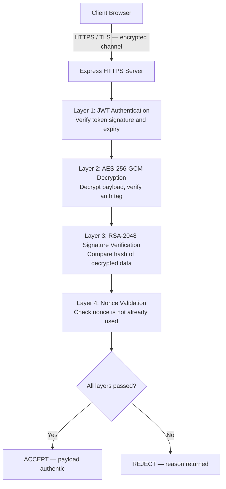

# Presentation Slides
## SEC-PRJ-7E_25 — Fake Data Prevention with Conventional Cryptographic Tools

---
---

## SLIDE 1 — Title

### Fake Data Prevention with Conventional Cryptographic Tools

| | |
|---|---|
| **Project Code** | SEC-PRJ-7E_25 |
| **Course** | System Security |
| **Student** | [Student Name] |

---

> **Speaker Notes (20 sec):**
> "This project addresses a fundamental problem in network security: how can a server verify that the data it receives is authentic and has not been tampered with? I will demonstrate a solution using conventional cryptographic tools."

---
---

## SLIDE 2 — The Security Problem

### Without Integrity Protection, Any Data Can Be Faked

**Example — A financial transaction:**

```
Legitimate request:    { "amount": 100,   "to": "Bob"      }
                                ↓
Modified by attacker:  { "amount": 99999, "to": "Attacker" }
```

**The server cannot distinguish one from the other.**

**Why this matters:**
- Financial fraud — unauthorized value modification
- Identity fraud — unauthorized recipient substitution
- Data corruption — any field can be altered without detection

---

> **Speaker Notes (35 sec):**
> "Consider a simple transaction: a client sends amount 100 to Bob. Without any integrity controls, a network-level attacker can intercept the request and modify the amount to 99999, redirecting the funds to a different account. The server has no mechanism to detect this. This is the core problem the project solves."

---
---

## SLIDE 3 — Security Objectives

### Five Properties Required for Secure Data Transmission

| Property | Definition | Satisfied By |
|---|---|---|
| **Authentication** | Verify the identity of the sender | JWT (HS256) |
| **Confidentiality** | Ensure data is unreadable in transit | AES-256-GCM |
| **Integrity** | Detect any unauthorized modification | RSA-2048 Digital Signature |
| **Replay Protection** | Prevent reuse of captured valid requests | UUID Nonce |
| **Transport Security** | Encrypt the communication channel | TLS / HTTPS |

---

> **Speaker Notes (35 sec):**
> "The solution requires five distinct security properties. Authentication ensures only authorized users can submit data. Confidentiality ensures the data cannot be read in transit. Integrity ensures any modification is detected. Replay protection ensures a captured valid request cannot be retransmitted. And transport security protects the channel itself. Each property requires a different cryptographic tool."

---
---

## SLIDE 4 — System Architecture

### Four Verification Layers on the Secure Endpoint



**Any single layer failure → immediate rejection.**

---

> **Speaker Notes (45 sec):**
> "The architecture implements four sequential verification layers. First, the JWT is verified — this ensures only authenticated users can submit requests. Second, the AES-256-GCM ciphertext is decrypted — the authentication tag automatically detects ciphertext tampering. Third, the RSA digital signature is verified against the decrypted payload — this detects any data modification. Fourth, the nonce is checked against a server-side record — this detects replayed requests. If any layer fails, the request is immediately rejected with an explanation."

---
---

## SLIDE 5 — Technologies Used

### Conventional Cryptographic Tools

| Technology | Standard | Purpose |
|---|---|---|
| **TLS Certificate** | X.509, RSA-2048 | Encrypts the transport channel; prevents passive eavesdropping |
| **JWT** | HS256 (HMAC-SHA256) | Stateless authentication token; signed by server secret |
| **AES-256-GCM** | NIST SP 800-38D | Symmetric encryption with built-in authentication tag (AEAD) |
| **RSA-2048 + SHA-256** | PKCS#1 v1.5 | Asymmetric digital signature; proves data origin and integrity |
| **UUID Nonce** | RFC 9562 (UUIDv4) | One-time value; cryptographically bound inside the signature |
| **bcrypt** | Cost factor 10 | Slow, salted password hash; resists brute-force attacks |

---

> **Speaker Notes (40 sec):**
> "All technologies used are conventional, standardized, and widely deployed. TLS uses a self-signed certificate for the localhost demonstration — the encryption strength is identical to a CA-signed certificate. AES-256-GCM is an authenticated encryption scheme, meaning it simultaneously provides confidentiality and integrity at the cipher level. The RSA signature provides application-level integrity. The nonce is embedded inside the RSA-signed payload, so it cannot be replaced without breaking the signature. bcrypt replaces plaintext password storage."

---
---

## SLIDE 6 — Demonstration Scenarios

### Five Scenarios — Insecure vs. Secure

| # | Scenario | Endpoint | Expected Result | Security Property |
|---|---|---|---|---|
| **1** | Send legitimate data — no protection | `/send-insecure` | **ACCEPTED** | Baseline |
| **2** | Send tampered data — no protection | `/send-insecure` | **ACCEPTED** | Demonstrates vulnerability |
| **3** | Send legitimate data — all layers | `/send-secure` | **ACCEPTED** | Full protection |
| **4** | Send tampered signed data | `/send-secure` | **REJECTED** | Integrity verification |
| **5** | Replay a captured valid request | `/send-secure` | **REJECTED** | Replay protection |

**Run in order: 0 (Login) → 1 → 2 → 3 → 4 → 5**

---

> **Speaker Notes (25 sec):**
> "The demonstration has five scenarios. Scenarios 1 and 2 show what happens without protection. Scenarios 3 through 5 show the same attacks attempted against the protected endpoint. The contrast makes the value of each cryptographic layer immediately observable."

---
---

## SLIDE 7 — Scenario 2: Data Tampering Attack (Attack Succeeds)

### Without Integrity Controls — Any Modification Is Accepted

```
Step 1 — Adversary intercepts:  POST /send-insecure
                                { "amount": 100, "from": "Alice", "to": "Bob" }

Step 2 — Adversary modifies:    { "amount": 99999, "from": "Alice", "to": "Attacker" }

Step 3 — Server response:       { "status": "accepted" }
```

**Root cause:** No authentication. No signature. No integrity check.
The server has no mechanism to verify the origin or content of the payload.

---

> **Speaker Notes (35 sec):**
> "In Scenario 2, the adversary modifies the payload before it reaches the server. The server has no way to detect this because it performs no verification whatsoever. It accepts any JSON it receives. This is the attack the cryptographic solution must prevent. Notice that the data is syntactically valid — the attack does not require exploiting a software bug. It exploits the complete absence of an integrity mechanism."

---
---

## SLIDE 8 — Scenario 4: Digital Signature Verification (Attack Fails)

### RSA-2048 Detects Any Payload Modification

```
Step 1 — Legitimate signature obtained for:
         { "amount": 100, "from": "Alice", "to": "Bob", "nonce": "uuid-A" }

Step 2 — Adversary modifies payload to:
         { "amount": 99999, "from": "Alice", "to": "Attacker", "nonce": "uuid-A" }
         (original signature reused)

Step 3 — Server decrypts, then verifies:
         SHA-256({ amount: 99999 ... }) ≠ SHA-256({ amount: 100 ... })
         → Signature mismatch detected

Step 4 — Server response:  { "status": "rejected",
                             "error": "Signature verification failed." }
```

**Why RSA works:** The hash of modified data does not match the hash that was signed.

---

> **Speaker Notes (45 sec):**
> "In Scenario 4, the adversary modifies the payload but reuses the original digital signature. When the server receives the request, it decrypts the payload successfully — the ciphertext was not modified. Then it computes SHA-256 of the decrypted data and attempts to verify it against the signature using the public key. Because the data has been modified, the hash does not match. The signature verification fails and the server rejects the request. This is exactly the guarantee that RSA digital signatures provide: any single-bit modification to the data produces a completely different hash."

---
---

## SLIDE 9 — Scenario 5: Replay Attack Prevention (Attack Fails)

### Nonce-Based Replay Protection

```
Step 1 — Scenario 3:  Valid request sent and accepted.
                       Nonce "uuid-A" recorded by server.

Step 2 — Adversary captures the complete request:
          { encryptedPayload: "...", signature: "..." }
          (data, ciphertext, and signature are all valid)

Step 3 — Adversary retransmits the identical request.

Step 4 — Server decrypts → signature valid → checks nonce:
          "uuid-A" is already in the nonce store.
          → Replay detected.

Step 5 — Server response:  { "status": "rejected",
                             "error": "Nonce has already been used." }
```

**Key design:** Nonce is inside the RSA-signed payload — it cannot be replaced without breaking the signature.

---

> **Speaker Notes (45 sec):**
> "Scenario 5 demonstrates why digital signatures alone are insufficient. Even a perfectly valid signed request can be captured and retransmitted — the data is authentic, the signature verifies, and the JWT is still valid. Without replay protection, this would be accepted indefinitely. The solution embeds a UUID nonce inside the RSA-signed and AES-encrypted payload. The server records every accepted nonce. On the second submission of the same request, the nonce check fails and the server rejects it. Because the nonce is inside the signature, an adversary cannot substitute a fresh nonce without invalidating the signature."

---
---

## SLIDE 10 — Security Controls Summary

### Each Attack Vector Has a Dedicated Countermeasure

| Attack Vector | Countermeasure | Technology |
|---|---|---|
| Unauthorized access | Authentication token verification | JWT (HS256) |
| Passive eavesdropping | Transport channel encryption | TLS / X.509 |
| Payload interception and reading | Symmetric payload encryption | AES-256-GCM |
| Data modification in transit | Digital signature verification | RSA-2048 + SHA-256 |
| Replay of captured requests | One-time nonce tracking | UUID (RFC 9562) |
| Credential brute-force | Adaptive key derivation | bcrypt (cost 10) |

---

> **Speaker Notes (30 sec):**
> "This table summarizes the complete threat model and the corresponding control for each attack vector. None of these controls is redundant — each addresses a distinct threat. Removing any one control leaves a specific attack vector unprotected. This layered approach is the central conclusion of the project."

---
---

## SLIDE 11 — Results

### All Security Objectives Achieved

| Implementation | Status |
|---|---|
| HTTPS / TLS with self-signed certificate | Implemented |
| JWT authentication (HS256) | Implemented |
| AES-256-GCM payload encryption | Implemented |
| RSA-2048 digital signature verification | Implemented |
| Nonce-based replay attack protection | Implemented |
| bcrypt password hashing (cost factor 10) | Implemented |
| Environment variable secret management | Implemented |
| Restricted CORS configuration | Implemented |

**All five demo scenarios produce the expected outcome.**

---

> **Speaker Notes (25 sec):**
> "All security objectives defined at the start of the project have been implemented and verified through the five demonstration scenarios. The project goes beyond the minimum requirements by also implementing environment variable secret management, restricted CORS, and password hashing — controls that are necessary in any realistic deployment."

---
---

## SLIDE 12 — Conclusion

### Fake Data Prevention Requires a Layered Cryptographic Approach

**Core finding:**
No single cryptographic tool is sufficient. Each layer addresses one specific attack vector.

| Security Property | Conclusion |
|---|---|
| Authentication | A valid identity does not guarantee data integrity |
| Encryption | Confidentiality does not guarantee authenticity |
| Digital Signature | Integrity does not guarantee freshness |
| Replay Protection | Freshness completes the security model |

**Final statement:**

> *This project demonstrates that conventional cryptographic tools — applied in a structured, layered architecture — can effectively prevent fake and tampered data from being accepted by a server.*

---

> **Speaker Notes (35 sec):**
> "The central conclusion is that fake data prevention cannot be achieved with a single control. The scenarios demonstrate this concretely: a valid signature does not prevent replay; encryption does not prevent tampering if the ciphertext is replaced; authentication does not prevent a legitimate user from sending modified data. Only by combining all four layers do we achieve a system where every known attack vector is covered. Thank you."

---
---

*End of presentation — 12 slides — estimated delivery time: 5–7 minutes*
